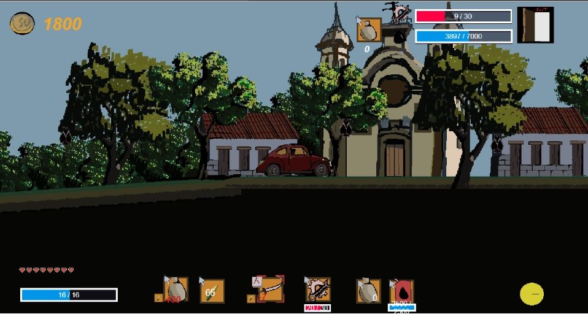

# Jogo cearence: migrando-de-volta-para-casa[Jogo Cearense plataforma 2d migrando de volta para casa,.html](https://github.com/user-attachments/files/25020929/Jogo.Cearense.plataforma.2d.migrando.de.volta.para.casa.html)
<!DOCTYPE html>
<html leng="pt-br">
<head>
   <meta charset="UFT-8">
   <Title> Jogo migrando de volta para casa </Title>
 

 

<body>
<a1 class="letraprincipal">Migrando de volta para casa um Jogo Cearence, com muitas lembranças do nosso passado </a1>

<n0>  plaformas e sites relacionados </n0>

</img>

<a href="https://mateusolivera2025.itch.io/migrando-de-volta-para-casa-httpswwwinstagramcompdqxo7-ueust" target="_blank" class="botao-itchio"> ir para minha loja no itch.io</a>
        Ver no Itch.io

                                  <n1>            Jogo Migrando de Volta para Casa</n1>
  

  <video width="640" height="360" controls>
    <source src="Migrando de volta pra casa  2026-01-15 19-00-54.mp4" type="video/mp4">
    </video>
  <n2> apresentção do jogo na fase Nordeste</n2>
    <video width="640" height="360" controls>
        <source src="Migrando de volta pra casa  2026-01-15 19-01-52.mp4" type="video/mp4">
        </video>
<n3></n3>
    

</body>
</html>
